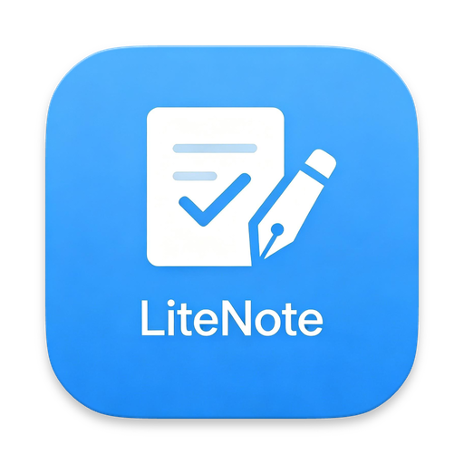
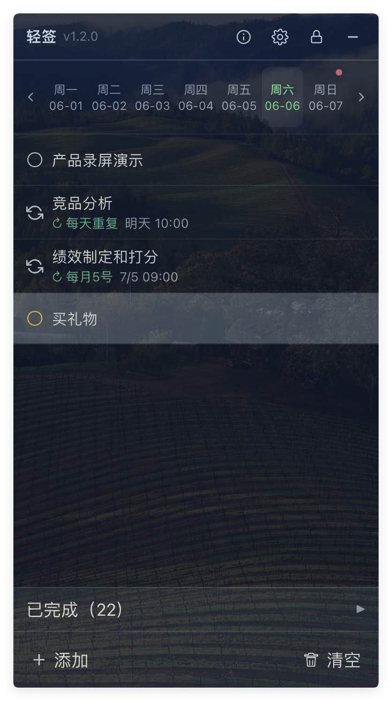
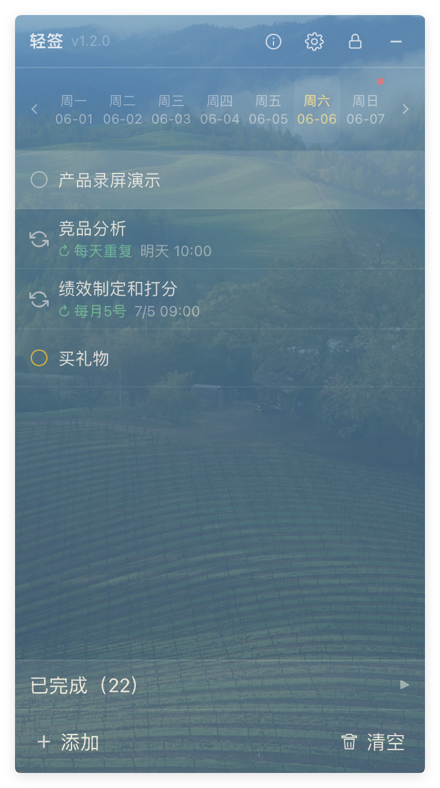
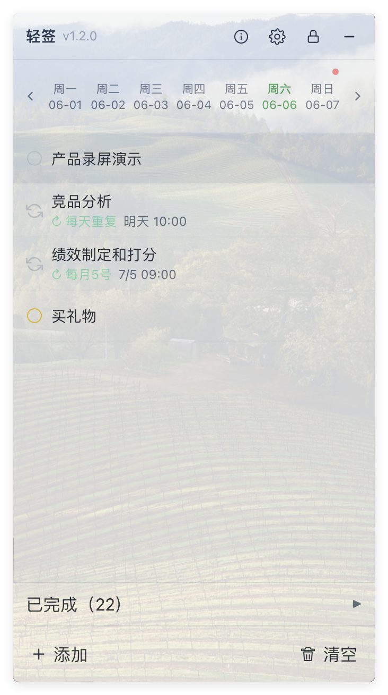

<!-- markdownlint-disable -->

<div align="center">



# LiteNote

Lightweight, customizable local to-do desktop widget<br>
Built with Tauri 2 + React

[Issues](https://github.com/SeaZhusp/LiteNote/issues) · [Changelog](docs/CHANGELOG.md)


[](LICENSE)


</div>

---

## Why LiteNote

Many to-do and note-taking tools are feature-packed and heavy — not ideal for a sticky-on-desktop quick-capture widget. LiteNote focuses on **local to-do** management: borderless transparent panel, system tray resident, instant toggle with a hotkey. Your data stays on your machine.

## Features

- **Local To-Dos** — SQLite storage with create/edit/delete/complete, pin, priority colors, due dates, and drag-to-reorder

- **Recurring Tasks** — Daily/weekly/monthly repeats with customizable time and target day; auto-advances to the next cycle

- **Due Date Reminders** — Set due dates on tasks; system notification 15 minutes before. Recurring tasks remind per their schedule

- **Week Calendar** — Mon–Sun calendar bar at the top; switch weeks, click a day to filter tasks. Red dot = due tasks, orange dot = overdue

- **Drag-to-Date** — Drag a to-do onto a calendar cell to set its due date instantly

- **Desktop Widget Experience** — Frosted glass transparency, adjustable opacity, always-on-top, minimize to system tray

- **Multiple Themes** — Choose from Glass, Dark, or Light themes; switch instantly with live preview

- **Global Hotkey** — `Ctrl+Shift+L` (`⌘+Shift+L` on macOS) to toggle the main window

- **Inline Settings & About** — All configuration (appearance, theme, language, startup) in a modal dialog; no separate windows

- **Cross-Platform** — Windows (NSIS installer + portable) and macOS (`.app` / `.dmg`)

<p align="center">
  &nbsp;
  &nbsp;
  &nbsp;
</p>

## Use Cases

- Lightweight to-do list that lives on your desktop
- Quick capture while gaming, watching videos, or working
- Periodic reminders (drink water, weekly meetings, monthly bills, etc.)
- Time-sensitive task reminders with local notifications

## Installation

Download the latest version from [GitHub Releases](https://github.com/SeaZhusp/LiteNote/releases).

> **Windows users:** Some enterprise/LTSC editions of Windows 10 may lack WebView2 Runtime. The installer bundles a bootstrapper to install it automatically. If issues persist, manually install [WebView2 Runtime](https://developer.microsoft.com/microsoft-edge/webview2/).

## Building from Source

### Prerequisites

- [Node.js](https://nodejs.org/) 18+ & [pnpm](https://pnpm.io/)
- [Rust](https://www.rust-lang.org/tools/install) stable
- [Tauri CLI 2](https://v2.tauri.app/)

**Windows additional:** Microsoft C++ Build Tools (MSVC) + Windows SDK

**macOS additional:** Xcode Command Line Tools

### Steps

```bash
git clone https://github.com/SeaZhusp/LiteNote.git
cd LiteNote

pnpm install

# Development (Tauri + hot-reload)
pnpm tauri dev

# Frontend only (no Tauri APIs)
pnpm dev
```

## Star History

[](https://star-history.com/#SeaZhusp/LiteNote&Date)

## Contributing

Issues and pull requests are welcome! Please submit via [GitHub Issues](https://github.com/SeaZhusp/LiteNote/issues).

## License

This project is licensed under the [MIT License](LICENSE).
